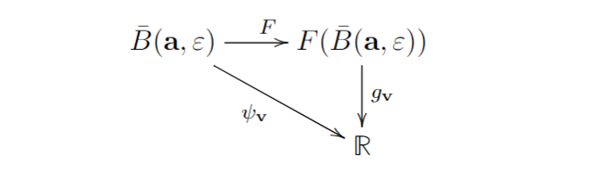

# Теорема о неявной и обратной функций

:::{prf:theorem} Теорема об обратной функции 
:label: inverse_function_theorem
Пусть $\mathscr{U}, \mathscr{V} \subseteq \mathbb{R}^n$ — два открытых множества, и пусть $F:\mathscr{U} \to \mathscr{V}$ — дифференцируемое отображение. Пусть $(\mathrm{d}F)_\m{a}$ обратимо в точке $\m{a} \in \mathscr{U}$. Тогда существуют такие открытые множества $\widetilde{\mathscr{U}}, \widetilde{\mathscr{V}} \subseteq \mathbb{R}^n$, что $\m{a} \in \widetilde{\mathscr{U}}$, $F(\m{a}) \in \widetilde{\mathscr{V}}$, $ F: \widetilde{\mathscr{U}} \to \widetilde{\mathscr{V}}$ — биективно, и, более того, его обратное $F^{-1}:\widetilde{\mathscr{V}} \to \widetilde{\mathscr{U}}$ — дифференцируемое.
:::

:::{prf:proof}
:class: dropdown
:nonumber:
Так как $F$ — дифференцируемое в $\mathscr{U}$, то для любых точек $\m{a}, \m{a}+\m{h} \in \mathscr{U}$ имеет место равенство
$$
F(\m{a} + \m{h}) - F(\m{a}) = (\mathrm{d}F_\m{a})\m{h} + \alpha(\m{h})\| \m{h}\|, \qquad \|\m{h}\| \to 0.
$$

(1) Так как $\mathscr{U}$ — открыто, то для любой точки $\m{c} \in \mathscr{U}$ найдётся открытый шар $B(\m{c},r) \subseteq \mathscr{U}$. Согласно Аксиоме Выбора, мы можем выбрать любые две разные точки: $\m{x},\m{y} \in B(\m{c},r)$. Рассмотрим отображение:
$$
\chi_{\m{x},\m{y}}: [0,1] \to \mathbb{R}^n, \qquad t \mapsto  \m{x}t + (1-t)\m{y},
$$
покажем, что $\chi_{\m{x},\m{y}}(t) \in B(\m{c},r)$ для любого $t \in [0,1]$. Действительно, имеем $\|\m{x} - \m{c}\|, \|\m{y} - \m{c}\| < r$, тогда для любого $t \in [0,1]$ получаем

$$\begin{align*}
\| (t\m{x}+ (1-t)\m{y}) - \m{c}\| &=& \|  t\m{x}+ (1-t)\m{y}- t\m{c} - (1-t)\m{c}\|  \\
&= & \| t(\m{x} - \m{c}) + (1-t)(\m{y} - \m{c})  \| \\
&\le & t \| \m{x} - \m{c} \| + (1-t) \| \m{y}  -\m{c} \| \\
&<& tr + (1-t)r = r,
\end{align*}$$
т. е. $\m{x}t + (1-t)\m{y} \in B(\m{a},r)$ для любого $t \in [0,1].$

(2) Пусть отображение $F$ определено следующим образом

$$F: \begin{pmatrix}
x_1 \\ \vdots \\ x_n
\end{pmatrix} \mapsto 
\begin{pmatrix}
f_1(x_1,\ldots, x_n) \\
\vdots \\
f_n(x_1,\ldots, x_n)
\end{pmatrix}.
$$

Определим для каждого $1 \le i \le n$ функцию $\varphi_i(t):[0,1] \to B(\m{a}, r)$ следующим образом
$$
\varphi_i(t): = f_i(t\m{x} + (1-t)\m{y}), \qquad 1\le i \le n,
$$
другими словами, $\varphi_i: = f_i \circ \chi_{\m{x},\m{y}}$,

Пусть $\m{z}_t:=t\m{x} + (1-t)\m{y}$, тогда по теореме о дифференциале композиции ) получаем
$$\begin{eqnarray}
\varphi'_i(t) &=& (\mathrm{d}f_i)_{\m{z}_t} \cdot \chi'_{\m{x},\m{y}}(t) \\
&=& (\mathrm{d}f_i)_{\m{z}_t} \cdot (\m{x} - \m{y}) \\
&=& \begin{pmatrix}
\dfrac{\partial f_i}{\partial x_1}({\m{z}_t}) & \ldots & \dfrac{\partial f_i}{\partial x_n} ({\m{z}_t})
\end{pmatrix} \begin{pmatrix}
x_1 - y_1 \\
\vdots \\
x_n -y_n
\end{pmatrix} \\
&=& \sum_{k=1}^n \dfrac{\partial f_i}{\partial x_k}({\m{z}_t}) (x_k - y_k) .
\end{eqnarray}$$

(3) По теореме Лагранжа  существует такой $\vartheta_i \in (0,1)$, что 
$$
\varphi_i(1) - \varphi_i(0) = \varphi_i'(\vartheta_i),
$$
тогда, положив $\m{z}_i: = \vartheta_i \m{x} + (1-\vartheta_i)\m{y}$ и принимая во внимание, что $\varphi_i(1) - \varphi_i(0) = f_i(\m{x}) - f_i(\m{y})$, мы получаем
$$\begin{eqnarray}
F(\m{x}) - F(\m{y}) &=& \begin{pmatrix}
f_1(\m{x}) - f_1(\m{y})\\
\vdots \\
f_n(\m{x}) - f_n(\m{y})
\end{pmatrix} = \begin{pmatrix}
\dfrac{\partial f_1}{\partial x_1}(\m{z}_1) & \ldots & \dfrac{\partial f_1}{\partial x_n}(\m{z}_1) \\
\vdots & \ddots & \vdots \\
\dfrac{\partial f_n}{\partial x_1}(\m{z}_n) & \ldots & \dfrac{\partial f_n}{\partial x_n}(\m{z}_n)
\end{pmatrix}\begin{pmatrix}
x_1-y_1\\
\vdots \\
x_n - y_n
\end{pmatrix} = J(\m{z}_1,\ldots, \m{z}_n)(\m{x} - \m{y}).
\end{eqnarray}$$

В связи с этим рассмотрим функцию 

$$
\mathrm{det}(J): \underbrace{\mathbb{R}^n \times \cdots \times \mathbb{R}^n}_n \to \mathbb{R}, \qquad (\m{x}_1,\ldots, \m{x}_n) \mapsto \mathrm{det} \begin{pmatrix}
\dfrac{\partial f_1}{\partial x_1}(\m{x}_1) & \ldots & \dfrac{\partial f_1}{\partial x_n}(\m{x}_1) \\
\vdots & \ddots & \vdots \\
\dfrac{\partial f_n}{\partial x_1}(\m{x}_n) & \ldots & \dfrac{\partial f_n}{\partial x_n}(\m{x}_n)
\end{pmatrix}
$$

Так функция $\mathrm{det}$ — непрерывная, то $\mathrm{det}(J)$ непрерывная, с другой стороны, $\mathrm{det}J(\m{a},\ldots, \m{a}) = \mathrm{det} (\mathrm{d}F)_a$. По условию, $(\mathrm{d}F)_\m{a}$ — обратима, т.е. $\mathrm{det} (\mathrm{d}F)_a \ne 0$, т.е. $\mathrm{det}(J(\m{a},\ldots,\m{a})) \ne 0$. Но тогда в силу непрерывности $\mathrm{det}(J)$ можно найти такой открытый шар $B(\m{a}, \varepsilon)$, что для любых $\m{z}_1,\ldots, \m{z}_n \in B(\m{a},\varepsilon)$ $\mathrm{det}(J)(\m{z}_1,\ldots, \m{z}_n) \ne 0.$

(4) Итак, пусть $\m{x},\m{y} \in B(\m{a},\varepsilon)$, $\m{x} \ne \m{y}$, тогда из предыдущих рассуждений мы получаем

\begin{equation}\label{F(x)-F(y)}
F(\m{x}) - F(\m{y}) = J(\m{z}_1,\ldots, \m{z}_n)(\m{x}- \m{y})    
\end{equation}

и так как $\mathrm{det}(J)(\m{z}_1,\ldots, \m{z}_n) \ne 0$, то $J(\m{z}_1,\ldots, \m{z}_n) \ne 0$, и тогда $F(\m{x}) \ne F(\m{y}).$

$$\boxed{
\boxed{
\textbf{Вывод: мы нашли такой шар $B(\m{a}, \varepsilon)$, что отображение $F: B(\m{a}, \varepsilon) \to F(B(\m{a}, \varepsilon))$ — биекция!}}}$$

(5) Покажем, что $F(B(\m{a}, \varepsilon))$ — открытое, т.е. для любой точки $\m{x} \in F(B(\m{a}, \varepsilon))$ найдётся такой шар малого радиуса с центром в $F(\m{x})$, который будет содержаться в $F(B(\m{a}, \varepsilon)).$

Для таких целей мы рассмотрим функцию $\psi_\m{v}(\m{y}): = \| F(\m{y}) - \m{v}\|^2$ на замкнутом в $\mathscr{U}$ шаре $\bar B(\m{a}, \varepsilon)$, которую можно определить как наклонную стрелку в диаграмме

где $g_\m{v}(\m{b}): = \| \m{b} - \m{v}\|^2 = \left( \sqrt{ (b_1-v_1) + \cdots + (b_n - v_n)^2 } \right)^2 = (b_1-v_1) + \cdots + (b_n - v_n)^2$, где $\m{b} = (b_1,\ldots, b_n)^\top$ и $\m{v} = (v_1,\ldots, v_n)^\top.$

Тогда по теореме о дифференциале композиции )
$$\begin{eqnarray}
(\mathrm{d} \psi_\m{v})_\m{y} &=&(\mathrm{d}g_\m{v})_{F(\m{y})} \cdot (\mathrm{d}F)_\m{y} \\
&=& \begin{pmatrix}
2(f_1(\m{y}) - v_1) & \ldots & 2(f_n(\m{y}) - v_n) 
\end{pmatrix} \begin{pmatrix}
\dfrac{\partial f_1}{\partial x_1}(\m{y}) & \ldots & \dfrac{\partial f_1}{\partial x_n}(\m{y}) \\
\vdots & \ddots & \vdots \\
\dfrac{\partial f_n}{\partial x_1}(\m{y}) & \ldots & \dfrac{\partial f_n}{\partial x_n}(\m{y})
\end{pmatrix} 
\end{eqnarray}$$
тогда для каждого $1 \le i \le n$
\begin{equation}\label{d(psi)}
\dfrac{\partial \psi}{\partial x_i}(\m{y}) = 2 \sum_{k=1}^n \dfrac{\partial f_i}{\partial x_k}(\m{y}) (f_i(\m{y}) - v_i).    
\end{equation}

$$\boxed{
\textbf{Мы хотим показать, что точка минимума этой функции находится в шаре $B(\m{a},\varepsilon)$.}}$$

(6) Рассмотрим функцию $\rho_\m{x}: \bar B(\m{a},\varepsilon) \to \mathbb{R}$, $\rho_\m{x}(\m{y}): = \| F(\m{y}) - F(\m{x})\|$, которая, очевидно, непрерывна. Пусть $\m{s} \in S(\m{a},\varepsilon): = \{\m{y}\in \mathbb{R}^n\, :\, \| \m{y} - \m{a}\| = \varepsilon\}$, так как $S$ — компакт (Следствие ), то, согласно Теореме , функция $\rho_\m{x}$, рассматриваемая только на $S$, достигает минимума, но так как $\rho_\m{x}(\m{s}) = \| F(\m{s}) - F(\m{x})\| = 0$, если и только если $\m{s} = \m{x}$ (потому что $F$ биективно на $B(\m{a},\varepsilon)$), то минимум этой функции положителен.

Тогда можно выбрать положительное число $\delta>0$ так, чтобы $\rho_\m{x}(\m{s}) = \| F(\m{s}) - F(\m{x})\| > 2 \delta$ для всех $\m{s} \in S(\m{a}, \varepsilon).$

(7) Покажем теперь, что открытый шар $B(F(\m{x}), \delta) \subseteq F(B(\m{a}, \varepsilon))$. Пусть $\m{v} \in B(F(\m{x}), \delta)$, т.е. $\| F(\m{x}) - \m{v}\| < \delta$. Для любого $\m{s} \in S(\m{a}, \varepsilon)$ согласно Лемме , получаем
$$\begin{align*}
\| F(\m{s}) - \m{v}\| &=& \| ( F(\m{s}) - F(\m{x} )) - (\m{v} - F(\m{x}))\| \\
&\ge & \Bigl|  \| F(\m{s}) - F(\m{x})  \| - \| \m{v} - F(\m{x}) \| \Bigr| \\
&>& |2\delta - \delta| = \delta.
\end{align*}$$

Вернёмся к функции $\psi_\m{v}(\m{y}): = \| F(\m{y}) - \m{v}\|^2$, определённой на $\bar B(\m{a}, \varepsilon)$, тогда получаем 
\begin{align*}
& \psi_\m{v}(\m{s}) = \| F(\m{s}) - \m{v}\|^2 > \delta^2, \qquad \m{s} \in S(\m{a},\varepsilon),\\
&\psi_\m{v}(\m{x}) = \| F(\m{x}) - \m{v}\|^2 <\delta^2.
\end{align*}

С другой стороны, $\bar B(\m{a}, \varepsilon)$ — компакт (так как он очевидно ограничен и замкнут согласно Лемме ), тогда функция (Теорема ) $\psi_\m{v}$ принимает на нём минимальное значение, но тогда из неравенств выше вытекает, что точка минимума $\m{w} \in B(\m{a},\varepsilon)$.

(8) В таком случае, если $\m{w}$ — точка минимума, то из необходимого признака , $\frac{\partial \psi}{\partial x_i}(\m{w})=0$, но так как $J \ne 0$ в шаре $B(\m{a},\varepsilon)$, то из )вытекает, что $f_i(\m{w}) = v_i$ для каждого $1\le i \le n$, т. е. $\m{v} = F(\m{w})$.

Итак, мы взяли произвольную точку $\m{v} \in B(F(\m{x}, \delta)$ и только что показали, что $\m{v} = F(\m{w})$, где $\m{w} \in B(\m{a},\varepsilon)$, но это и означает, что $B(F(\m{x}, \delta) \subseteq F(B(\m{a}, \varepsilon))$, т. е. мы показали, что $F(B(\m{a}, \varepsilon))$ — открыто.

(9) Нам осталось показать, что $F^{-1}$ дифференцируемо в $F(B(\m{a},\varepsilon))$, т. е. для любой точки $\m{a}' \in F(B(\m{a},\varepsilon))$ существует такой линейный оператор $\Phi_{\m{a}'}$, что для любых двух точек $\m{a}', \m{a}' + \m{h}' \in F(B(\m{a},\varepsilon))$ имеет место равенство
$$
F^{-1}(\m{a}' + \m{h}') - F^{-1}(\m{a}') = \Phi_{\m{a}'}(\m{h}') + \beta(\m{h}') \| \m{h}'\|, \qquad \m{h}' \to \m{0}_n.
$$

Пусть $\m{a}: = F^{-1}(\m{a}')$ и $\m{a} + \m{h} := F^{-1}(\m{a}' + \m{h}')$, т. е. $F(\m{a}) = \m{a}'$ и $F(\m{a} + \m{h}) = \m{a}' + \m{h}'$. 

Тогда
$$\begin{eqnarray}
\Phi_{\m{a}'}(\m{h}') &=& \Phi_{\m{a}'}\left( F(\m{a} + \m{h}) - \m{a}'  \right) \\
&=& \Phi_{\m{a}'}\left( F(\m{a} + \m{h}) - F(\m{a}) \right)
\end{eqnarray}$$
так как $F$ дифференцируемо в $\mathscr{U}$, то, согласно определению,
$$
F(\m{a} + \m{h}) - F(\m{a}) = (\mathrm{d}F_\m{a})\m{h} + \alpha(\m{h})\| \m{h}\|, \qquad \|\m{h}\| \to 0
$$
тогда, требуя, чтобы $\Phi_{\m{a}'}$ была обратной к матрице $(\mathrm{d}F)_\m{a}$, получаем
$$\begin{eqnarray}
\Phi_{\m{a}'}(\m{h}')&=& \Phi_{\m{a}'}\left( (\mathrm{d}F_\m{a})\m{h} + \alpha(\m{h})\| \m{h}\| \right) \\
&=& \m{h} + \Phi_{\m{a}'}(\alpha(\m{h}))\cdot \| \m{h}\|
\end{eqnarray}$$

Рассмотрим теперь 
$$
\beta(\m{h}'): = \frac{\|\m{h}\|}{\| \m{h}'\|}\Phi_{\m{a}'}(\alpha(\m{h})) ,
$$
и покажем, что $\lim_{\m{h}' \to \m{0}_n} \beta(\m{h}') = 0$.

Вернёмся к равенству (-F(y))) и рассмотрим теперь функцию $J(\m{z}_1,\ldots, \m{z}_n)$ на замкнутом шаре $\bar B(\m{a},\varepsilon)$, тогда по теореме , эта функция принимает минимальное значение $\mu$, **т.е.,** мы получаем
$$
\| F(\m{x}) - F(\m{y})\| = \| J(\m{x}-\m{y})\| \ge \mu \|\m{x} - \m{y}\|.
$$

Так как $\m{h}'= F(\m{a} + \m{h}) - F(\m{a})$, то из неравенства выше, получаем
$$
\| \m{h}'\| =\| F(\m{a} + \m{h}) - F(\m{a}) \| \ge  \mu \| \m{h} \|.
$$

Тогда
$$
\beta(\m{h}'): = \frac{\|\m{h}\|}{\| \m{h}'\|}\Phi_{\m{a}'}(\alpha(\m{h})) \le \mu \Phi_{\m{a}'}(\alpha(\m{h})),
$$
в силу непрерывности $\Phi_{\m{a}'}$ (так как это линейный оператор, Лемма ), мы получаем, что 
$$
\beta(\m{h}'): = \Phi_{\m{a}'}(\alpha(\m{h})) \to 0, \qquad \m{h}' \to \m{0}_n,
$$
что и показывает $\lim_{\m{h}' \to \m{0}_n} \beta(\m{h}') = 0$, а тогда имеет место равенство 
$$
F^{-1}(\m{a}' + \m{h}') - F^{-1}(\m{a}') = \Phi_{\m{a}'}(\m{h}') + \beta(\m{h}') \| \m{h}'\|, \qquad \m{h}' \to \m{0}_n.
$$

Тем самым, теорема об обратной функции полностью доказана.
:::

:::{prf:theorem}[Теорема о неявной функции]
:label: implicit_function_theorem
Пусть $\m{x} \in \mathbb{R}^n$, $\m{y} \in \mathbb{R}^m$, $\mathscr{W}$ — окрестность точки $(\m{x}_0, \m{y}_0) \in \mathbb{R}^n \times \mathbb{R}^m$, отображение $F: \mathscr{W} \to \mathbb{R}^m$ непрерывно дифференцируемо, $F(\m{x}_0, \m{y}_0) = \m{0}_m$ и якобиан отображения $\m{y}\mapsto F(\m{x}_0, \m{y})$ в точке $\m{y}_0$ отличен от нуля. Тогда найдутся открытые окрестности $\mathscr{U}$ и $\mathscr{V}$ точек $\m{x}_0$ и $\m{y}_0$ в $\mathbb{R}^n$ и $\mathbb{R}^m$ и непрерывно дифференцируемое отображение $f: \mathscr{U} \to \mathscr{V}$, обладающее следующим свойством: для точки $(\m{x}, \m{y}) \in \mathscr{U} \times \mathscr{V}$ равенство $F(\m{x}, \m{y}) = 0$ эквивалентно равенству $\m{y} = f(\m{x}).$

Для точки $\m{x} \in \mathscr{U}$ дифференциал отображения $f$ при этом можно вычислить по формуле
$$
(\mathrm{d}f)_\m{x} = - \left( \mathrm{d}_2F \right)^{-1}_{(\m{x}, f(\m{x}))} \circ (\mathrm{d}_1 F)_{(\m{x}, f(\m{x}))},
$$
где $\mathrm{d}_1$ — дифференциал отображения $F$ с фиксированными переменными $\m{y}$, а $\mathrm{d}_2$ — дифференциал отображения $F$ с фиксированными переменными $\m{x}$.
:::

:::{prf:proof}
:class: dropdown
:nonumber:
Для заданного отображения $F(\m{x},\m{y})$ мы положим $\Phi(\m{x},\m{y}):=(\m{x}, F(\m{x},\m{y}))$. Тогда 
$$
(\mathrm{d}\Phi)_{(\m{x}_0, F(\m{x}_0, \m{y}_0))} = \begin{pmatrix}
E & O \\
O & (\mathrm{d}F)_{(\m{x}_0,\m{y}_0)}
\end{pmatrix}
$$
Тогда $\mathrm{det} (\mathrm{d}\Phi)_{(\m{x}_0, F(\m{x}_0, \m{y}_0))} \ne 0$ и по теореме об обратной функции , имеется обратное к $\Phi$ отображение $\Psi$, т.е. $\Psi(\Phi(\m{x},\m{y})) = (\m{x},\m{y})$, или, другими словами $\Psi(\m{x}, F(\m{x},\m{y})) = (\m{x},\m{y})$. Тогда если $F(\m{x},\m{y})=0$, то вектор $f(\m{x})$ это вектор $\Psi(\m{x}, \m{0}_m)$ без первых $n$ координат.
:::

:::{prf:definition}
Пусть $\mathscr{U}\subseteq \mathbb{R}^n$, $\mathscr{V}\subseteq \mathbb{R}^m$  — открытые множества. Отображение $F:\mathscr{U} \to \mathscr{V}$ называется отображением класса $C^p$, $p \ge 0$ при этом пишут $F\in C^p(\mathscr{U},\mathscr{V})$, если оно $p$ раз дифференцируемо. В случае $p=0$, $F$ есть просто непрерывное отображение. Если же $p = \infty$, то $F$ называется **гладким.**
:::

:::{prf:definition}
Пусть $\mathscr{U}, \mathscr{V} \subseteq \mathbb{R}^n$ — открытые множества. Отображение $F:\mathscr{U} \to \mathscr{V}$ класса $C^p$ называется **диффеоморфизмом** класса $C^p$, если $F$ — биективно и $F^{-1} \in C^p(\mathscr{V}, \mathscr{U}).$
:::

:::{prf:definition}
Отображение $F\in C^p(\mathscr{U}, \mathscr{V})$, $\mathscr{U}, \mathscr{V} \subseteq \mathbb{R}^n$ называется **этальным** в точке $\m{a} \in \mathscr{U}$ (или **локальным диффеоморфизмом**) класса $C^p$, если на некоторой окрестности $\mathscr{U}'$ это точки оно является диффеоморфизмом класса $C^p$ это окрестности на окрестность $F(\mathscr{U'})$ точки $F(\m{a}).$
:::

Тогда в новых терминах **теорема об обратном отображении** утверждает, что
*если в точке $\m{a} \in \mathscr{U}$ дифференциал $(\mathrm{d}F)_\m{a}$ отображения $F \in C^p(\mathscr{U}, \mathscr{V})$ обратим, то существуют такое открытое множество $\mathscr{U}' \subseteq \mathscr{U}$, содержащее точку $\m{a}$, что $F:\mathscr{U}' \to \mathscr{V}' \subseteq \mathscr{V}$ — диффеоморфизм на некоторое открытое множество $\mathscr{V}' \subseteq \mathscr{V}$, содержащее точку $F(\m{a})$.*